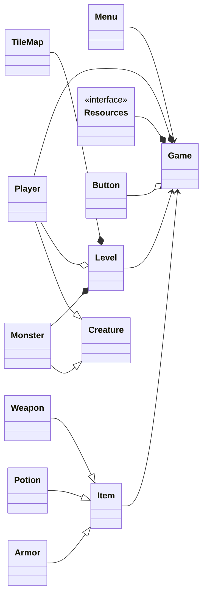
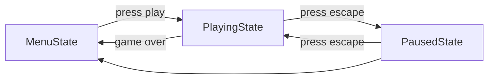

# Evolving Dungeon

"Evolving Dungeon" is a simple dungeon crawler game created using C++ and SFML.

## Table of Contents

-   [Project Implementation](#project-implementation)
-   [Plan](#plan)
-   [Implemented Features](#implemented-features)
-   [Working Practices](#working-practices)
-   [Testing](#testing)
-   [Source Code Documentation](#source-code-documentation)
-   [Credits](#credits)

## Project Implementation

The project uses GitHub submodules to get the required SFML libraries, as it does for the googletest when performing tests.

If you are using Linux, make sure you have the [following](https://www.sfml-dev.org/tutorials/2.6/compile-with-cmake.php) installed for cmake to work correctly. One way of compiling the project with CMake when using Linux is to use the following commands:

```bash
git clone --recurse-submodules https://github.com/juhalo/evolving-dungeon.git
cd evolving-dungeon
cmake -S ./ -B ./build
cmake --build build
./build/bin/EvolvingDungeon

```

You may also clone it normally and then run the command "git submodule init" followed by the command "git submodule update" instead of the --recurse-submodules tag.

## Plan

### (Planned) Features

-   [ ] Animations
-   [ ] Combat
-   [ ] Customizable key bindings
-   [ ] Friendly NPCs
-   [ ] Game UI
-   [ ] High scores
-   [ ] Item crafting
-   [ ] Items
-   [ ] Level
-   [x] Menu
-   [ ] Minimap
-   [ ] Movement of other creatures
-   [ ] Movement of player
-   [ ] Online high scores
-   [x] Pause menu
-   [ ] Player progression (skills etc.)
-   [ ] Player quests
-   [ ] Player skills
-   [ ] Randomly generated items
-   [ ] Random generated levels
-   [ ] Saving and loading functionality
-   [ ] Scene graph
-   [ ] Sound
-   [ ] Stack of states for different game states
-   [x] State pattern for different game states
-   [ ] Textures
-   [ ] Tile map
-   [ ] Win/lose conditions

Scene graph is more complex than is currently needed, therefore it is not a high priority. Online high scores may or may not be implemented.

### High-level structure



Menu handles game creation as well as saving and loading the a game. Menu is also responsible for loading in the textures/sounds/fonts.

Game handles game logic, user input during game, time keeping and calling level's update and drawing functionality.

Level handles rendering and updating level, monsters and the player.

Tile map holds information about the currently loaded level's background and draws it.

### State Pattern

The game uses state pattern for handling different states (menu, ongoing game, paused game, end screen etc.) of the game. In the future this may be expanded/changed to use stack of states. Entities might also use state pattern when they are implemented.

The current (implemented) potential states of the game are:



Note that "game over" has not been implemented yet and at some point there will also be a state to signify the end screen (implementing game over with transition to menu straight away will be an in-between step; this is also why PlayingState still has a pointer to MenuState).

## Working Practices

Uses feature and hotfix branches. Feature branches will be named feature/my-feature and hotfixes will be named hotfix/my-hotfix. Only when everything is working, it is merged to the main branch (in other words, the project follows a very simple, GitHub flow type of workflow which is currently more than necessary for a single person). Releases will be generated for different versions of the game, whenever necessary. If there is a need for a more complex workflow, such as git-flow, these practices will/might change.

Git tags will be used to denote releases. Here _v1.4.2_ stands for second hotfix of the fourth minor release of the first major release. Every major release should we very stable and every minor release should aim to be as stable as possible. _v1.4.0-rc1_ is first candidate for v1.4.0.

The golden rule of git rebase is to never use it on public branches is followed (rebase may be used on local main with origin/main, but not with any other branch, i.e. _git pull --rebase origin main_, when on local main branch). In general, rebasing local changes that have been made, but haven't been shared yet, before pushing them in order to clean up the story, is fine, but rebasing anything that has been pushed to upstream should be avoided unless specified in this README. When rebasing, creating a copy of branch for safe keeping is advised. This branch should have the prefix _temp/_ and it should be fast forward merged after rebasing to avoid unnecessary merge commit. Also, rebase from main to feature/bugfix branch if main has changed is allowed and encouraged.

After pushing the feature or bugfix branch to origin, create a corresponding pull request. If the merge would close an issue and it has not been put to be resolved in one of the commit messages related to the merge, then in the description of the merge it should read _closes #43_ or something similar accepted by GitHub. This closes the issue automatically.

The full git usage guidelines for this project are as follows (huge credit to [atlassian](https://www.atlassian.com/git/tutorials/merging-vs-rebasing)):

```bash
# How to create a branch
git checkout main
git pull --rebase origin main
git checkout -b feature/new-feature

# Use small, incremental commits
git add src/file.cpp
git add include/file.hpp
# If single line commit message is enough
git commit -m "Do something"
# end if
# Else if you wish to use text editor for bigger/multi-line message
git commit
# end if

# Push branch for pull request; note if branch has been pushed upstream, do NOT use rebase anymore for the branch
git push origin feature/new-feature

# If tracking connection wants to be made; note if branch has been pushed upstream, do NOT use rebase anymore for the branch
git push -u origin feature/new-feature

# Pulling from feature branch that has been pushed to upstream
git pull --rebase origin feature/new-feature

# After doing pull request in GitHub
git checkout main
git fetch -p
git branch -d feature/new-feature
# Only do the following if you have to and you know what you are doing
git branch -D feature/new-feature

# Use this to change/combine commits in LOCAL branch that has NOT been pushed upstream, do on temp/ branch to make sure no funny business occurs, rebase is a destructive operation
git checkout feature/new-feature
git checkout -b temp/new-feature
git merge-base temp/new-feature main
# This returns the COMMIT_ID of the original base
git rebase -i COMMIT_ID
git checkout feature/new-feature
git reset --hard temp/new-feature
git branch -d temp/new-feature
# Only do the following if you have to and you know what you are doing
git branch -D temp/new-feature

# If main has been changed in-between creating this branch and current moment, do NOT use otherwise
git checkout feature/new-feature
git fetch origin
git checkout -b temp/new-feature
git rebase origin/main
git checkout feature/new-feature
git reset --hard temp/new-feature

# Tagging is used for releases, lightweight tags are discouraged
git tag -a v1.4.0 -m "my version 1.4.0"
```

The coding style guide followed is the [WebKit Code Style Guidelines](https://www.sfml-dev.org/style.php) and it might use elements from [SFML Code Style Guide](https://www.sfml-dev.org/style.php) to make it consistent with the major library used throughout the project. The project might also use Google C++ style guide etc. to fill in some blanks. These changes are documented in the styleguide/ folder's readme.

GitHub Projects is used together with issues for organizing different parts that are planned to be completed.

## Testing

Uses googletest for the automatic tests for individual components/classes as well as interactions between different classes. Manual tests are also used to check that the game works properly. The testing is created together with the classes and changed if the classes change. In the main branch, all of the tests should pass at all times but this might not be the case for feature branches.

Testing can be found under tests/ folder and it has a readme.md that goes into much more detail about how the testing was done. To run the tests, clone the repository (as shown above, since you need the git submodules), follow the steps from [Project Implementation](#project-implementation), and then:

Go to tests/ and then type the following:

```bash
cmake -S . -B build
cmake --build build
cd build
ctest --rerun-failed --output-on-failure

```

Valgrind checks are commented about in the folder tests/ as well.

## Source Code Documentation

Doxygen was used for documentation and creation of the pdf. The generated pdf file can be found under the doc/ folder.

## Credits

Font used by Cody "CodeMan38" Boisclair under the SIL Open Font License, Version 1.1, from [here](https://www.zone38.net/font/)

The book [SFML Game Development](https://www.packtpub.com/product/sfml-game-development/9781849696845) by Artur Moreira, Henrik Vogelius Hansson and Jan Haller. This book taught me a whole lot about SFML game development and game development in general (before this project I have not had proper experience with game development).
