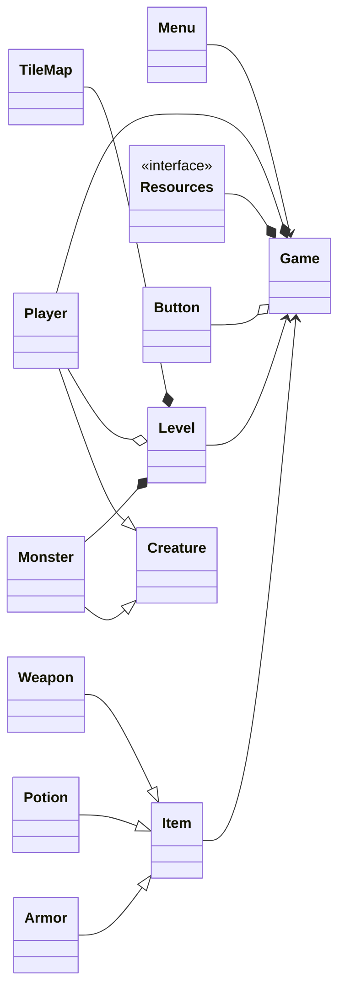

# Evolving Dungeon

"Evolving Dungeon" is a simple dungeon crawler game created using C++ and SFML.

## Table of Contents

-   [Project Implementation](#project-implementation)
-   [Plan](#plan)
-   [Implemented Features](#implemented-features)
-   [Working Practices](#working-practices)
-   [Testing](#testing)
-   [Source Code Documentation](#source-code-documentation)
-   [Credits](#credits)

## Project Implementation

The project uses GitHub submodules to get the required SFML libraries, as it does for the googletest when performing tests.

If you are using Linux, make sure you have the [following](https://www.sfml-dev.org/tutorials/2.6/compile-with-cmake.php) installed for cmake to work correctly. One way of compiling the project with CMake when using Linux is to use the following commands:

1. git clone --recurse-submodules https://github.com/juhalo/evolving-dungeon.git
2. cd evolving-dungeon
3. cmake -S ./ -B ./build
4. cmake --build build
5. ./build/bin/EvolvingDungeon

You may also clone it normally and then run the command "git submodule init" followed by the command "git submodule update" instead of the --recurse-submodules tag.

## Plan

### (Planned) Features

-   [ ] Animations
-   [ ] Combat
-   [ ] Customizable key bindings
-   [ ] Friendly NPCs
-   [ ] Game UI
-   [ ] High scores
-   [ ] Item crafting
-   [ ] Items
-   [ ] Level
-   [x] Menu
-   [ ] Minimap
-   [ ] Movement of other creatures
-   [ ] Movement of player
-   [ ] Online high scores
-   [ ] Player progression (skills etc.)
-   [ ] Player quests
-   [ ] Player skills
-   [ ] Randomly generated items
-   [ ] Random generated levels
-   [ ] Saving and loading functionality
-   [ ] Scene graph
-   [ ] Sound
-   [ ] Textures
-   [ ] Tile map
-   [ ] Win/lose conditions

Scene graph is more complex than is currently needed, therefore it is not a high priority. Online high scores may or may not be implemented.

### High-level structure

Menu handles game creation as well as saving and loading the a game. Menu is also responsible for loading in the textures/sounds/fonts.

Game handles game logic, user input during game, time keeping and calling level's update and drawing functionality.

Level handles rendering and updating level, monsters and the player.

Tile map holds information about the currently loaded level's background and draws it.

## Working Practices

Uses feature and hotfix branches. Feature branches will be named feature/my-feature and hotfixes will be named hotfix/my-hotfix. Only when everything is working, it is merged to the main branch (in other words, the project follows a very simple, GitHub flow type of workflow which is currently more than necessary for a single person). Releases will be generated for different versions of the game, if necessary. If there is a need for a more complex workflow, such as git-flow, this will change.

The coding style guide followed is the [WebKit Code Style Guidelines](https://www.sfml-dev.org/style.php) and it might use elements from [SFML Code Style Guide](https://www.sfml-dev.org/style.php) to make it consistent with the major library used throughout the project. The project might also use Google C++ style guide etc. to fill in some blanks. These changes are documented in the styleguide/ folder's readme.

GitHub Projects is used together with issues for organizing different parts that are planned to be completed.

## Testing

Uses googletest for the automatic tests for individual components/classes as well as interactions between different classes. Manual tests are also used to check that the game works properly. The testing is created together with the classes and changed if the classes change. In the main branch, all of the tests should pass at all times but this might not be the case for feature branches.

Testing can be found under tests/ folder and it has a readme.md that goes into much more detail about how the testing was done. To run the tests, clone the repository (as shown above, since you need the git submodules), follow the steps from [Project Implementation](#project-implementation), and then:

Go to tests/ and then type the following:

1. cmake -S . -B build
2. cmake --build build
3. cd build
4. ctest --rerun-failed --output-on-failure

Valgrind checks are commented about in the folder tests/ as well.

## Source Code Documentation

Doxygen was used for documentation and creation of the pdf. The generated pdf file can be found under the doc/ folder.

## Credits

Font used by Cody "CodeMan38" Boisclair under the SIL Open Font License, Version 1.1, from [here](https://www.zone38.net/font/)
